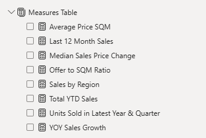
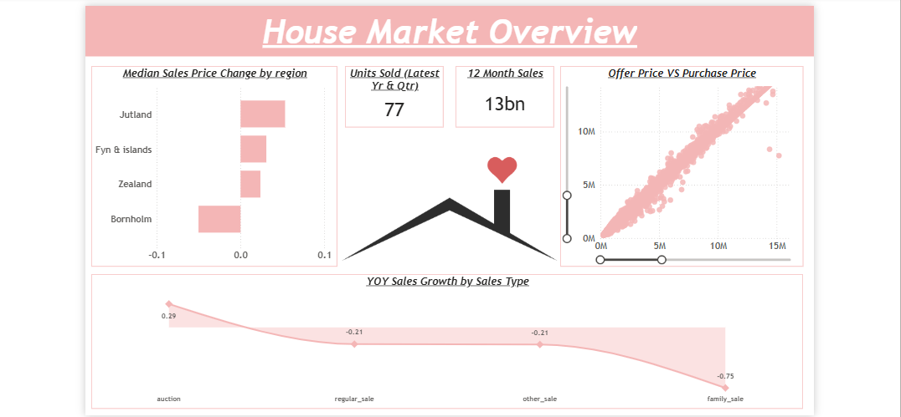
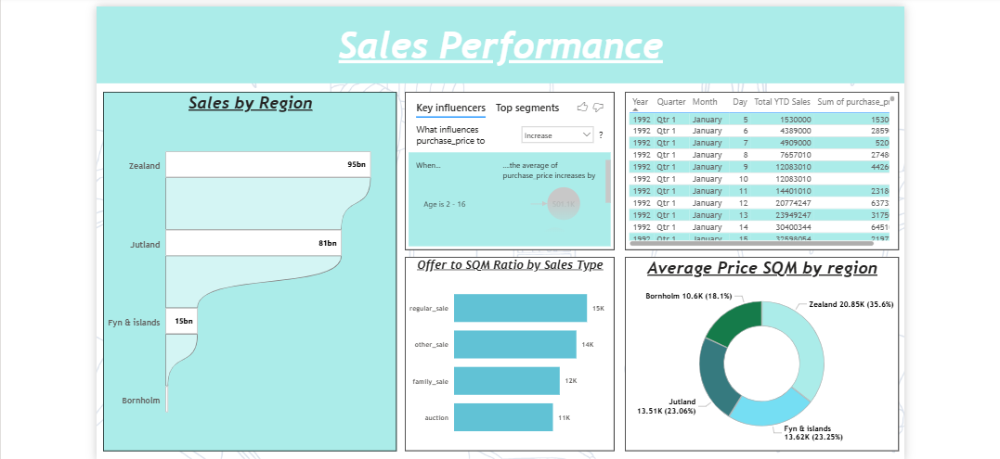
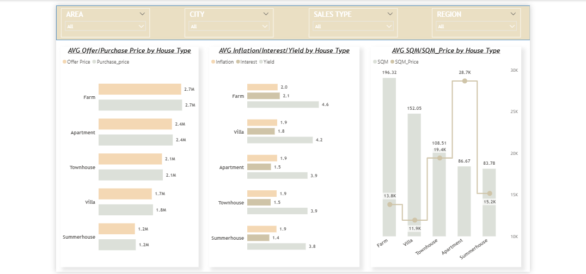

# Denmark Housing Market Analysis
## Property Sales, Pricing and Economic Factors

## 📝 Project Overview
This project analyzes the Denmark housing market to uncover key drivers of property prices, regional performance differences, sales behaviour and the impact of macroeconomic indicators such as interest rates, inflation and mortgage bond yields.

The objective is to transform raw transactional data into actionable insigts that support strategic decision-making for home buyers, investors, developers and policymakers.

---

## 🎛️ Table of Contents
- [Project Overview](#project_overview)
- [Dataset](#dataset)
- [Tools Used](#tools-used)
- [Data Cleaning](#data-cleaning)
- [Data Model/Measures Table](#data-model/measures-table)
- [Exploratory Data Analysis (EDA)](#exploratory-data-analysis-(eda))
- [Key Insights](#key-insights)
- [Dashboard](#dashboard)
- [Recommendations](#recommendations)

## 📂 Dataset

### Data Source
Dataset provided through a structured Udemy analytics training program.

### Data Description
The dataset captures detailed housing market transactions across Denmark, including property pricing, location attributes, sales channels, property characteristics and macroeconomic indicators.

### Dataset Size
- Rows: 100,000
- Columns: 19

### Key Fields
- Offer Price
- Purchase Price
- Region
- Sales Type
- SQM (Property size in square meters)
- SQM Price (Price per square meter)
- Nom_int_rate% (The nominal interest rate on property)
- Dk_ann_infl_rate% (Annual inflation rate in Denmark)
- Yield_on_mortgage_credit_bonds%

---

## 🛠️ Tools Used
- Google BigQuery - Data Storage and initial data loading.
- Power BI 
	- Data cleaning, transformation (Power Query Editor)
	- Data modeling, and visualization
- DAX Measures - KPI development and analytical measures

---

## 🧹 Data Cleaning
- Replaced null values in the City column with "Unknown"
- Replaced null values in the Dk_ann_infl_rate% column with the highest available value
- Replaced null values in the Yield_on_mortgage_credit_bonds% column with the highest available value
- Standardized data types and ensured consistency across fields

---

## 🧠 Data Model/Measures Table

### Key Measures Used

|Measure Name|Description|
|------------|-----------|
|Average Price SQM|Average price per square meter|
|Last 12 Month Sales|Total sales within the last 12 months|
|Median Sales Price Change|Median Change in sales price over time|
|Offer to SQM Ratio|Relationship between Offer price and size|
|Sales by Region|Total sales grouped by region|
|Total YTD Sales|Year-to-date total sales|
|Units Sold in Latest Year & Quarter|Property sales in latest period|
|YOY Sales Growth|Year-over-year growth in sales|

### Measures Table

---

## 📊 Exploratory Data Analysis (EDA)
- Property listing prices closely align with the final purchase price, suggesting a highly efficient pricing market.
- A strong positive relationship exists between property size and purchase price.
- Zealand records the highest total sales value, making it the most dominant region in the housing market.
- House prices vary across regions and over time, with certain areas experiencing stronger growth than others.
- Auction-based sales are experiencing positive year-on-year growth while family sales have declined sharply.
- Regular sales demonstrate strong price efficiency relative to property size.

---

## 🔍 Key Insights
- Jutland recorded the highest median price growth, indicating strong emerging demand.
-Bornholm shows sustained underperformance in both growth and transaction volume, suggesting weaker demand conditions. 
- There is a strong correlation between the offer prices and final purchase prices, showing an efficient pricing market.
- Zealand remains the most expensive and dominant region across all pricing metrics.
- Auction sales are increasing in popularity, while family sales are declining.
- Farm house type shows the highest price levels, indicating niche premium demand

---

## 📊 Dashboard
An interactive Power BI report was developed to provide a multi-dimensional view of the Danish housing market, including:
- Regional price and sales performance
- Property type analysis
- Year-over-year market growth trends
- Economic factor relationships
The dashboard enables dynamic exploration of market behaviour across time, geography and property segments.
Interactive filters were implemented to support dynamic exploration of market trends across locations and sales type.

### Dashboard 1: Market Overview

###Dashboard 2: Sales Performance

### Dashboard 3: House Type Analysis

---

## 💡 Recommendations
🏡 For Home Buyers
- Evaluate price per square meter before making purchasing decisions
- Consider regions outside Zealand for more affordable housing options

📈 For Investors
- Prioritize high-growth regions such as Jutland and Zealand
- Monitor underperforming regions like Borholm for potential value-driven entry points.

🏗️ For Developers
- Prioritize development in regions with strong demand and high sales volume.
- Investigate drivers of weak performance in Bornholm before expansion.

🏛️ For Policymakers
- Address affordability pressures in high-prized regions such as Zealand.
- Support economic growth in slower-performing regions to balance housing demand.
